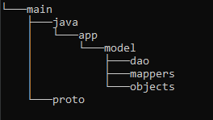
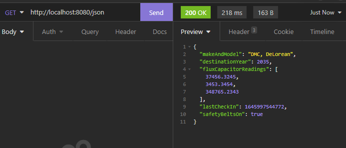
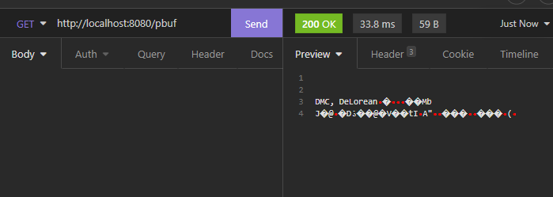

## What You Will Learn
In this tutorial we will serve protobuf to an application over HTTP (or HTTP2 for performance). \\

Our goal will be to take sensor data from a specific type of machine, serialize that data with protobuf, and then hand that
off to our frontend via HTTP.

## What Is Protobuf?
Protobuf is shorthand for Protocol Buffers. Protocol Buffers are a typed system for serializing data, similar to XML or JSON. 
Unlike XML, protobuf is very small, and unlike JSON, the data sent via protobuf can be typed as opposed to being a string by default.
In many cases this means that messages with protobuf payloads are more lightweight and faster in practice than messages with 
comparable JSON payloads.

## Dependencies

First we create a Gradle project with our dependencies [(→ Tutorial)](/tutorials/gradle-setup).\\
We will be using Javalin for our web-server, slf4j for logging, and protobuf for data serialization:

```groovy
dependencies {
    implementation 'org.slf4j:slf4j-simple:1.8.0-beta4'
    implementation 'io.javalin:javalin:4.3.0'
    implementation 'com.fasterxml.jackson.core:jackson-databind:2.13.1'
    implementation 'com.google.protobuf:protobuf-java:3.19.4'
}
```

## Other Setup
This tutorial assumes you will be using the Gradle build tool in order to build your project. Without Gradle you can alternatively
use the build scripts provided in the sample repository to automate some of the build process.

To see all of this code in action and skip the tutorial, you can alternatively clone the repository 
[here.](https://github.com/The-Funk/serving-protobuf-with-javalin)

## Application Structure
The Javalin application is fairly simple however we will both generate and utilize Protobuf within the same scope of work.
Some best practices recommend creating a separate directory structure for generated files, in our case we'll keep things 
simple and store our generated Java classes in a folder under our src directory.    

Let's start by building our project structure. Here's a quick directory tree. Go ahead and add these directories under 'src'
in your project.



Take note that the "model" subdirectory contains the majority of the files used in this example. This is because this 
tutorial focuses on the model portion of the MVC design pattern, specifically we want to serialize data with protobuf. 
How you choose to implement your control and view code is entirely up to you.

## The Data

Now that we have our directory structure, let's dive right in and create our first plain ole' Java object (POJO). This will
represent our sensor data that we wish to read from either a database or the machinery itself.

In the pojo directory go ahead and create a SensorData class like so...



    package app.model.objects.pojo;
     
    import java.sql.Timestamp;
    import java.util.List;
    
    import static app.model.mappers.BaseMapper.sqltimeToProtoTime;
    
    public class SensorData implements Serializable {
    
        private String makeAndModel;
        private int destinationYear;
        private List<Double> fluxCapacitorReadings;
        private Timestamp lastCheckIn;
        private boolean safetyBeltsOn;
    
        public String getMakeAndModel() { return makeAndModel; }
        public void setMakeAndModel(String makeAndModel) { this.makeAndModel = makeAndModel; }
    
        public List<Double> getFluxCapacitorReadings() { return fluxCapacitorReadings; }
        public void setFluxCapacitorReadings(List<Double> fluxCapacitorReadings) { this.fluxCapacitorReadings = fluxCapacitorReadings; }
    
        public int getDestinationYear() { return destinationYear; }
        public void setDestinationYear(int destinationYear) { this.destinationYear = destinationYear; }
    
        public Timestamp getLastCheckIn() { return lastCheckIn; }
        public void setLastCheckIn(Timestamp lastCheckIn) { this.lastCheckIn = lastCheckIn; }
    
        public boolean isSafetyBeltsOn() { return safetyBeltsOn; }
        public void setSafetyBeltsOn(boolean safetyBeltsOn) { this.safetyBeltsOn = safetyBeltsOn; }
    
    }



Perfect! Now we have a model to represent our SensorData. In this case, we also implemented the Serializable interface
as a good practice to ensure compatibility with whatever JSON serializer we choose to use in the future. If we were simply 
sending and retrieving this data, we would have no need to create this intermediary POJO, however for most business use cases, 
you'll want to create this object despite its redundancy (more on that later).

Now let's add a quick fake DAO object so that we can 

## The .proto File

Now that we have a POJO representation of our SensorData, let's go ahead and create our first .proto file. Proto files are used
to describe a protocol buffer. After we write our .proto file, we will use it to generate corresponding Java code. Note that you
could use this same .proto file in your frontend to generate JavaScript or Dart code, etc.



    syntax = "proto3";
    // The package directive (when generating Java src files) tells protoc where to store the generated Java files
    package app.model.objects.generated;
    
    import "google/protobuf/timestamp.proto";
    
    // proto standard says field names should be lower_snake_case
    // except enum values (not covered here) which should be SCREAMING_SNAKE_CASE
    
    message SensorData {
    optional string make_and_model = 1;
    int32 destination_year = 2;
    repeated double flux_capacitor_readings = 3;
    optional google.protobuf.Timestamp last_check_in = 4;
    bool safety_belts_on = 5;
    }



## Anatomy of a .proto File

There's a lot going on in the short code snippet above, so let's cover just the basics, shall we?

* The above document uses the latest (at time of writing) proto3 syntax.
* The message keyword denotes a complex object we wish to represent. You can have multiple messages per proto file or just one.
* Every field in a .proto file is denoted by a positive integer value. For the sake of saving memory it's best to start with the lowest number possible (1) and work sequentially.
* The protobuf spec defines several primitive data types, you can see examples of them above including int32, double, bool, etc.
* To denote that a field could be omitted or "null" it's best to use the optional keyword. In our example, last_check_in and make_and_model can be null.
* Protos can be imported for use inside more complex protos. In this instance, timestamp requires a proto definition and our SensorData proto makes use of that definition.
* List types can be denoted using the repeated keyword
* gRPC API methods can be defined with the service keyword (outside the scope of this tutorial)

With those basics in mind, let's move on to generating our first Java class from a proto.

## Configuring the Gradle Protobuf Plugin

Now wait just one minute! Why are we creating a redundant Java class when we just created one only moments ago? 
Let's talk about what's happening here. We're about to generate Java code to represent our proto. 
However, this generated code is not meant to be edited. This means creating helper functions in the generated code is discouraged, 
in fact extending the generated code in any way is really inadvisable. This is because, if the schema were to change, 
first the proto file would need updated, then protoc would compile a new generated class, thereby undoing any work that might 
have been done inside that class. For this reason and others, we instead use the generated code for what it is, a means of 
serializing and representing an existing class.



    buildscript {
        repositories {
            mavenCentral()
        }
        dependencies {
            classpath 'com.google.protobuf:protobuf-gradle-plugin:0.8.18'
        }
    }
    
    plugins {
        id "com.google.protobuf" version "0.8.18"
        id 'java'
    }
    
    repositories {
        mavenLocal()
        maven {
            url = uri('https://repo.maven.apache.org/maven2/')
        }
    }
    
    dependencies {
        implementation 'org.slf4j:slf4j-simple:1.8.0-beta4'
        implementation 'io.javalin:javalin:4.3.0'
        implementation 'com.fasterxml.jackson.core:jackson-databind:2.13.1'
        implementation 'com.google.protobuf:protobuf-java:3.19.4'
    }
    
    sourceSets {
        main {
            proto {
                srcDir "src/main/proto"
            }
            java {
                srcDir "src/main/java"
            }
        }
        test {
            proto {
                // In addition to the default 'src/test/proto'
                srcDir "src/test/protocolbuffers"
            }
        }
    }
    
    group = 'tech.gmork'
    version = '1.0-SNAPSHOT'
    description = 'serving-protobuf-with-javalin'
    java.sourceCompatibility = JavaVersion.VERSION_16
    
    rootProject.tasks.named("processResources") {
        duplicatesStrategy = 'include'
    }
    
    protobuf {
        generatedFilesBaseDir = "$projectDir/src"
        // Configure the protoc executable
        protoc {
            // Download from repositories
            artifact = 'com.google.protobuf:protoc:3.19.4'
        }
    
        generateProtoTasks {
            // all() returns the collection of all protoc tasks
            all().each { task ->
                // Here you can configure the task
            }
    
            // (Java only) returns tasks for a sourceSet
            ofSourceSet('main')
    
        }
    }



## Understanding Our First Generated Class

With our build.gradle prepared and our .proto file in place, if we do a build on our project now, we should see a 
SensorDataOuterClass.java file generated within our generated directory. Congratulations, you've compiled your first protobuf 
class.

The Java code generated here has a few features we will be utilizing. The first is an inner Builder class, which allows us 
to build a protobuf object based around our proto schema. The second is a method which in Java is named ```toByteArray()```.

We will use the Builder class to build our SensorData object and then use ```toByteArray()``` to prepare our object for 
transmission using our HTTP API.

## Generating our Sample Data


## Comparing the JSON and Protobuf Responses

That wasn't so bad. Now that our app is running. Let's see what all the fuss is about with this protobuf stuff!

Let's start by loading up a REST API Client. My personal favorite is [Insomnia](https://insomnia.rest/) because it has
support for HTTP2 in addition to a bunch of other cool features. 

We'll leave out the set-up and just skip straight to the part where we make a request to our server.

Let's start with the JSON endpoint. We'll do a GET request to http://localhost:8080/json



<strong>218 milliseconds and 163 bytes.</strong> Not bad!

Now let's hit the protobuf endpoint and see what we get!



<strong>33.8 milliseconds and 59 bytes!</strong> Wow!

That's a bit over 6 times faster and a little more than 1/3 the size of our JSON response!

## Conclusion

That's it, you now have a basic understanding of protobuf and how it can be used within the context of a RESTful API. 

## Further Exploration

So we know protobuf is capable of providing a much smaller footprint than regular JSON but here's where things get complicated. 
What if our JSON payloads were compressed? With modern compression like Brotli, it's possible that we could shrink our JSON 
string-based payloads simply and efficiently. Examining how compression affects response times and payload sizes is outside 
the scope of this tutorial but could be useful in making a decision about how to serialize data in your applications. 
For some light reading and some basic protobuf vs JSON benchmarks, check out 
[this article](https://nilsmagnus.github.io/post/proto-json-sizes/).

Opinion: The big <i>advantages</i> of protobuf are that it can send typed data, and as such often sends data in the smallest 
and thus most efficient format. JSON sends everything as a string. Strings (assuming UTF-8) cost 8 bits per char. This might 
not seem like a big deal, but if your data isn't primarily strings, the size cost of strings can quickly add up. 
The <i>disadvantages</i> of protobuf are that the data payload is binary and the implementation of protobuf involves compiling
based on schema files (our .proto file in this tutorial), both of which make supporting and debugging code a little harder. 
Additionally, there are no widely used automatic serialization and deserialization tools for protobuf like there are with JSON. 
This sort of code must be written manually.